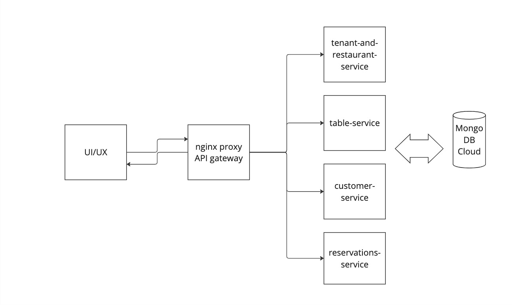

# Introduction
res-easy-services host the backend code required to handle the business logic for restaurant reservation system.

# Architecture
The repo is composed of 4 node js services, each service expose a set of APIs and runs on a particular port.
In order to abstract the ports from the outside world, an API gateway service is implemented using nginx which uses reverse proxy to route requests to a particular service.

So, from an external system or the frontend of the application, the requests would be made as if it is interacting with single system. However, there are multiple services in the backend doing their respective job.

# Run the app

In the root, run `docker compose build`
followed by 
`docker compose up -d`

NOTE: Try sudo if any permission error occurs

# Future scope
1) Evaluate the benefit of having a DB Connection service so each service does not maintain a db connection. Instead all requests are routed via a db service. But in that case we are creating a single point of failure as well for the whole system which is not great idea. But still need to see if giving services access to the db individually holds any value.

2) Add authentication and authorisation

3) Test all the endpoints and validate the use case

4) * Develop a front end for the customers to make reservations

5) * Develop a service which can send an email

6) * Call the email service for sending an email to the admin of the restaurant

7) * Call the email service to send email to the customer for the reservation and its current status

# MVP specification

1) A single page website for the SaaS business where new restaurants can sign up
Restaurant enters the following details to sign up
A new tenant is created. The tenant then logs in and can create restaurant and set it up.
Set its name,
          address,
          aggregateRating,
          priceRange,
          telephone,
          servesCuisine,
          url,
          image,
          geo,
          openingHours

          

2) Restaurant is provided with a hosted page where their customers can make dine-in bookings.

